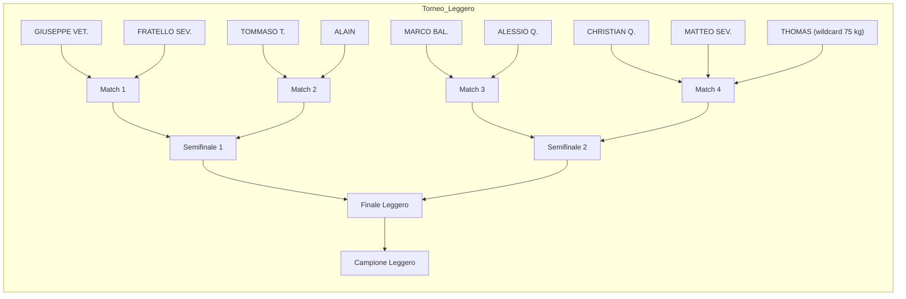
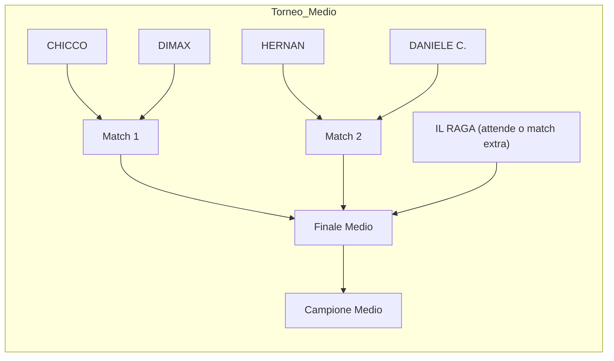
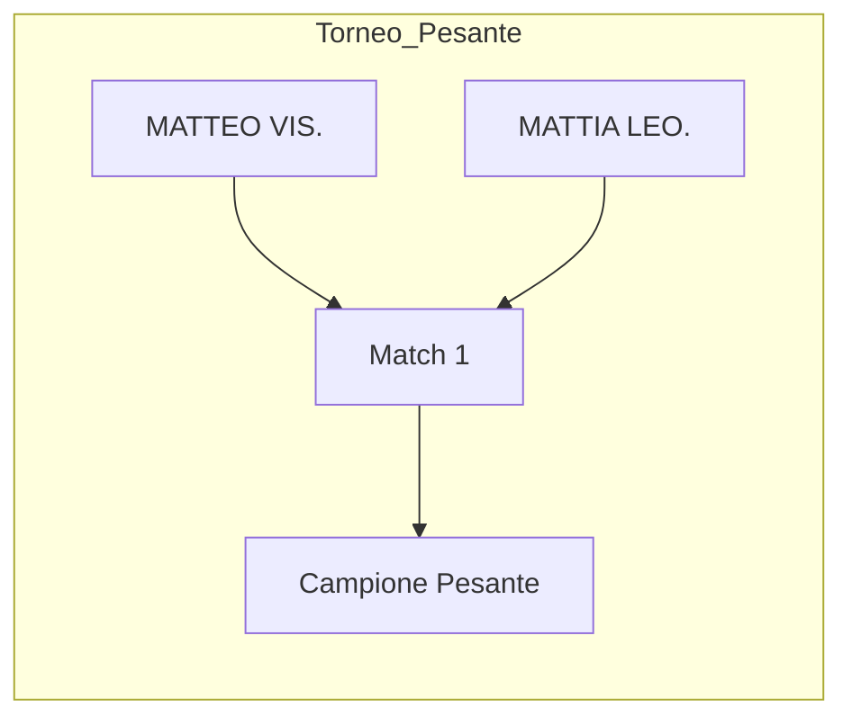

# Tabellone Torneo Fight Club (aggiornato)

Thomas è stato spostato nella categoria Leggero a 75 kg, quindi gli accoppiamenti sono stati aggiornati di conseguenza.

## Partecipanti

| Chi | Stile | Entrata | Soprannome | Peso | Quota | Categoria |
| :--- | :---: | :---: | :---: | :---: | :---: | :---: |
| ALAIN | | | | 69 | x | Leggero |
| ALESSIO Q. | | | | 63 | x | Leggero |
| CHRISTIAN Q. | | | | 72 | x | Leggero |
| FRATELLO SEV. | | | | 74 | x | Leggero |
| GIUSEPPE VET. | | | | 68 | x | Leggero |
| MARCO BAL. | | | | 73 | x | Leggero |
| MATTEO SEV. | | | | 74 | x | Leggero |
| TOMMASO T. | | | | 60 | x | Leggero |
| THOMAS | | | | 75 | x | Leggero |
| CHICCO | | | | 79 | x | Medio |
| DIMAX | | | | 78 | x | Medio |
| HERNAN | | | | 80 | x | Medio |
| DANIELE C. | | | | 84 | x | Medio |
| IL RAGA | | | | 85 | x | Medio |
| MATTEO VIS. | | | | 110 | x | Pesante |
| MATTIA LEO. | | | | 100 | x | Pesante |

### Dettagli Scommesse
* **Premio in palio:** 266,67 €
* **Puntata minima:** 10,00 €
* **Quantità scommettitori:** 15

### Categorie di Peso
* **Leggero:** 0-75 kg
* **Medio:** 76-85 kg
* **Pesante:** 85-120 kg

## Categoria Leggero

## Categoria Medio

## Categoria Pesante

